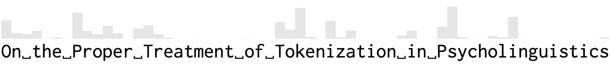

Mario Giulianelli, Luca Malagutti, Juan Luis Gastaldi, Brian DuSell, Tim Vieira, and Ryan Cotterell. 2024.
[On the proper treatment of tokenization in psycholinguistics](https://arxiv.org/abs/2410.02691).
In _Proceedings of the 2024 Conference on Empirical Methods in Natural Language Processing_.

**Code available soon.**

----------

BibTeX:
```
@inproceedings{giulianelli-etal-2024-proper,
    title={On the Proper Treatment of Tokenization in Psycholinguistics},
    author={Giulianelli, Mario and Malagutti, Luca and Gastaldi, Juan Luis and DuSell, Brian and Vieira, Tim and Cotterell, Ryan},
    booktitle = {Proceedings of the 2024 Conference on Empirical Methods in Natural Language Processing},
    year = {2024},
    publisher = {Association for Computational Linguistics},
    address = {Miami, Florida, USA},
    url={https://arxiv.org/abs/2410.02691}
}
```
